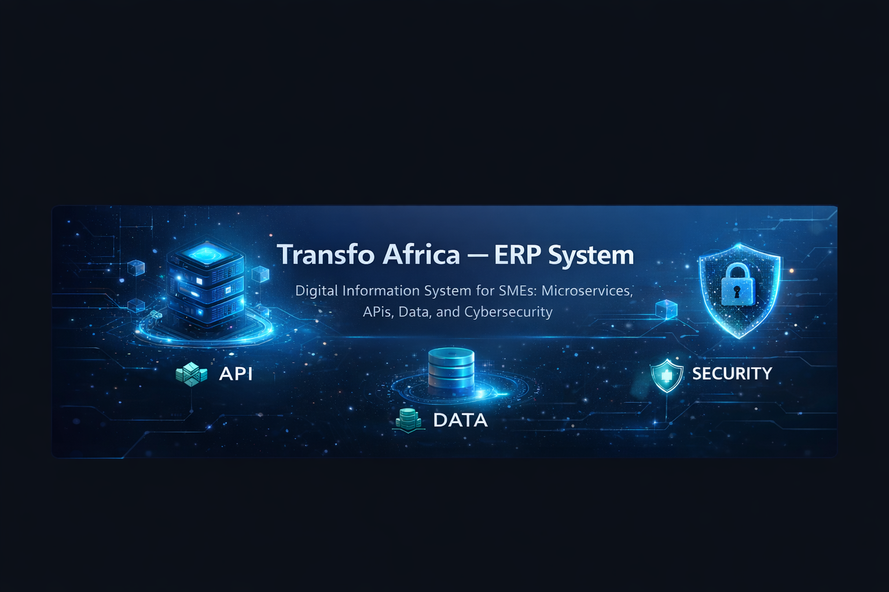

  

<h2 align="center">Transfo Africa — ERP Modulaire pour PME</h2>

Architecture SI • Data • Cybersécurité • Microservices

Architecture SI • Data • Cybersécurité • Microservices

  

  Objectif du projet
Conception et mise en œuvre d’un Système d’Information digital pour PME, basé sur une architecture  microservices sécurisée, visant à :

- Centraliser les données métiers  
- Automatiser les processus (ventes, achats, stock)  
- Améliorer la traçabilité  
- Piloter l’activité via des indicateurs (KPI)  

---

##  Rôle — Cheffe de Projet SI

Pilotage transverse du projet de bout en bout :

- Cadrage & analyse des besoins métiers  
- Modélisation des données  
- Conception de l’architecture SI  
- Coordination technique (backend / frontend)  
- Mise en place des pratiques de sécurité  
- Structuration des flux et des services  

---

##  Architecture du Système

Architecture basée sur des **microservices indépendants** :

- 🔐 `auth-service` → Authentification (JWT)  
- 🌐 `api-gateway` → Point d’entrée sécurisé  
- 👥 `contacts-service` → Clients & fournisseurs  
- 🛒 `ventes-service` → Commandes & devis  
- 📦 `stocks-service` → Gestion des stocks  
- 🧾 `facturation-service` → Facturation & paiements  
- 🖥️ `portal` → Interface utilisateur (Angular)  

---

##  Data & Modélisation

- Modélisation logique et physique des données  
- Structuration par domaine métier (microservices)  
- Relations optimisées entre entités  
- Intégrité et cohérence des données garanties  

---

##  Sécurité

- Authentification sécurisée via JWT  
- Sécurisation des API  
- Isolation des services  
- Préparation à l’audit des actions  

---

##  Pilotage & Vision SI

Le système permet :

- Une centralisation des données  
- Une meilleure visibilité opérationnelle  
- Une base exploitable pour KPI décisionnels  
- Une gouvernance SI structurée  

---

##  Stack Technique

- **Frontend** : Angular  
- **Backend** : Spring Boot (microservices)  
- **Base de données** : MariaDB  
- **Architecture** : Microservices  
- **DevOps** : Docker • CI/CD (GitHub Actions)  

---

## Valeur Ajoutée

- Vision globale SI + métier  
- Architecture scalable et modulaire  
- Intégration sécurité & gouvernance  
- Approche orientée performance et décision  

---

##  Positionnement

Projet réalisé dans une logique de :

- Architecture des Systèmes d’Information  
- Data & structuration des données  
- Cybersécurité  
- Gouvernance IT  

---

##  Accès

 https://github.com/gagoumrachelle48-sketch/transfo-africa-digital-system
